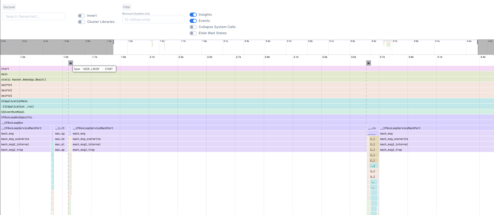

# ETTrace 👽

[](https://swiftpackageindex.com/EmergeTools/ETTrace)
[](https://swiftpackageindex.com/EmergeTools/ETTrace)

Locally measure performance of your app, without Xcode or Instruments. Read all about it in the [launch blog post](https://www.emergetools.com/blog/posts/ettrace-reliable-ios-profiling-with-flamecharts)


## Building and Installing

You can add ETTrace as a Swift package, select the "ETTrace" library as the product to add, not "ETTraceRunner".

Alternatively, run `./build.sh` to build the xcframework `ETTrace.xcframework`. Link the xcframework to your app.

Install the runner with `brew install emergetools/homebrew-tap/ettrace`

## Testimonials

Our users love ETTrace and find it essential in their iOS development process. Here’s what some of them have to say:

- **Keith Smiley, Principal Engineer @ Lyft**: "With ETTrace I can pinpoint exactly what is taking time in my app, and quickly find opportunities to improve it. It’s my go-to tool for in-depth performance analysis."

- **Bruno Rocha, Software Engineer @ Spotify**: "ETTrace is my favorite tool for diagnosing iOS performance, the flamechart view makes it easy to find bottlenecks and speed up app launch."

## Using

Launch your app and run `ettrace` or `ettrace --simulator`. After profiling, the result will be displayed on https://emergetools.com/flamegraph

Note: Always launch the app by manually tapping the icon on the iOS homescreen, running the app through Xcode can result in inaccurate results.

## dSYMs

You can point `ettrace` to a folder containing your dsyms with the `--dsyms` flag. If the dsyms are indexed by spotlight they will be automatically found and used.

## Run at Launch

Use the flag `--launch` to start recording on app launch. When you first connect to the app using this flag, the app will force quit. On the next launch it will start profiling automatically and capture all of your `main` function. In some cases you need to record the first launch after an install. You can't use the `--launch` flag for this because that requires re-launching the app. Instead, add a boolean set to `YES` in your Info.plist with the key `ETTraceRunAtStartup`. You can then run `ettrace` regularly, without the `--launch` flag, and still start profiling at the start of app launch.

## Under the hood

ETTrace spawns a new thread which captures a stacktrace of the main thread periodically. This is sampling based profiling. The sampling thread starts either when ettrace.framework is loaded (+load method), or when the CLI sends a message to the application. These control messages and the sampled data are communicated using PeerTalk.

## Adding events to the flamechart

ETTrace supports displaying events in the flamechart from version v1.0. You can use them to track user flows in your code, you can easily add them by posting a notification in your code:
```swift
NotificationCenter.default.post(name: Notification.Name(rawValue: "EmergeMetricStarted" | "EmergeMetricEnded"), 
                                object: nil,
                                userInfo: [
    "metric": "EVENT_NAME"
])
```
Use `EmergeMetricStarted` to register the start of your flow and `EmergeMetricEnded` to track it's end. 

For example we would post this notification to track the start of an user login flow.
```swift
NotificationCenter.default.post(name: Notification.Name(rawValue: "EmergeMetricStarted"), 
                                object: nil,
                                userInfo: [
    "metric": "USER_LOGIN"
])
```

And then this one when the user successfuly logins:
```swift
NotificationCenter.default.post(name: Notification.Name(rawValue: "EmergeMetricEnded"), 
                                object: nil,
                                userInfo: [
    "metric": "USER_LOGIN"
])
```

In the flamechart we would be able to see this flow as follows:


## Profiling background threads

Use the flag `--multi-thread` (`-m`) to record all threads. This will provide a output.json file for every thread recorded, which you can drag into ETTrace.