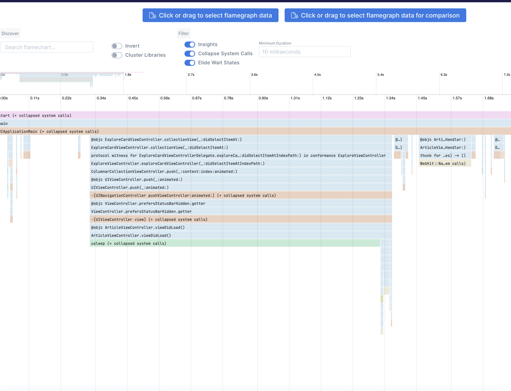

# ETTrace 👽

Locally measure performance of your app, without Xcode or Instruments.

## Building and Installing

Run `pod install` in the ETTrace folder. Modify the code signing team in `ETTrace/ETTrace.xcworkspace` to your own team. Run `./build.sh` to build the xcframework `ETTrace.xcframework`. Link the xcframework to your app.

Install the runner with `brew install emergetools/homebrew-tap/ettrace`

## Using

Launch your app and run `ettrace` or `ettrace --simulator`. After profiling, the result will be displayed on https://emergetools.com/flamegraph

Note: Always launch the app by manually tapping the icon on the iOS homescreen, running the app through Xcode can result in inaccurate results.

## dSYMs

You can point `ettrace` to a folder containing your dsyms with the `--dsyms` flag. If the dsyms are indexed by spotlight they will be automatically found and used.

## Run at Launch

Use the flag `--launch` to start recording on app launch. When you first connect to the app using this flag, the app will force quit. On the next launch it will start profiling automatically and capture all of your `main` function. In some cases you need to record the first launch after an install. You can't use the `--launch` flag for this because that requires re-launching the app. Instead, add a boolean set to `YES` in your Info.plist with the key `ETTraceRunAtStartup`. You can then run `ettrace` regularly, without the `--launch` flag, and still start profiling at the start of app launch.

## Why is it more accurate than instruments?

Since iOS 16, dyld4 will pre-compute many protocol conformances leading to [faster apps](https://www.emergetools.com/blog/posts/how-order-files-speed-up-protocols). Xcode Instruments uses DYLD_INSERT_LIBRARIES which disables this optimization. ETTrace does not disable it, so you can see the actual performance users will observe.

## Under the hood

ETTrace spawns a new thread which captures a stacktrace of the main thread periodically. This is sampling based profiling. The sampling thread starts either when ettrace.framework is loaded (+load method), or when the CLI sends a message to the application. These control messages and the sampled data are communicated using PeerTalk.
